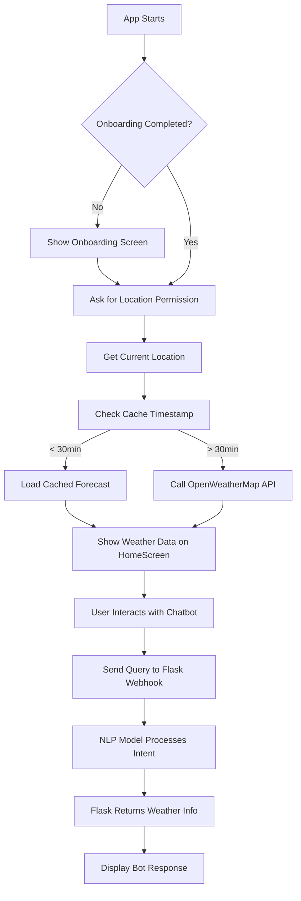

# 🌦️ Flutter Weather Forecast App with BLoC and AI Chatbot

A modern, clean Flutter app that provides a 5-day weather forecast using the OpenWeatherMap API. The app uses BLoC for state management, includes intelligent caching, and features an integrated AI-powered chatbot to answer user weather queries.

---

## 🚀 Features

* **5-Day / 3-Hour Interval Forecast:**
  Uses OpenWeatherMap's 5-day forecast API to display detailed weather updates.

* **Clean and Responsive UI:**
  Designed with usability in mind, with smooth transitions and responsive layout for various screen sizes.

* **BLoC State Management:**
  Efficient and scalable business logic using the BLoC pattern.

* **Intelligent Caching:**
  Saves forecast data locally and only refetches if the last data is older than 30 minutes, reducing API calls and improving performance.

* **Rain Teller:**
  Custom logic to detect and report rain chances today based on cloudiness, humidity, and precipitation data.

* **AI Chatbot Integration:**
  A Dialogflow-style chatbot built using a custom NLP model hosted on a Flask webhook. It understands user queries like:

  * "Will it rain today?"
  * "What is the temperature right now?"
  * "Tell me the wind speed"

* **Geolocation Support:**
  Automatically fetches and saves the user’s location for accurate weather info.

* **Robust Exception Handling:**

  * Location denied prompt
  * Internet disconnection message
  * Server unreachable fallback

---

## 🧠 Tech Stack

* **Flutter** with BLoC architecture
* **OpenWeatherMap API** for forecast data
* **Shared Preferences** for caching
* **Geolocator** for GPS location
* **Custom Flask Webhook** to handle NLP classification and intent matching
* **Dart** and **Python**

---

## 📂 Project Structure (Flutter)

```
lib/
├── bloc/               # ForecastBloc, Events, and States
├── models/             # ForecastItem, WeatherData, MainData, etc.
├── screens/            # HomeScreen, OnboardingScreen
├── services/           # WeatherService, LocationService, BotService
├── ui/                 # Reusable widgets, shimmer, charts
└── main.dart
```

---

## 🔧 How to Run

1. Clone the repository:

```bash
git clone https://github.com/Deadlywolf12/weather_bloc_app.git
```

2. Get dependencies:

```bash
flutter pub get
```

3. Add your OpenWeatherMap API key to `.env` file

4. Run the app:

```bash
flutter run
```

5. \[Optional] Start Flask Webhook (for chatbot):

```bash
#clonse the chatbot_webhook repo first 
cd chatbot_webhook
python app.py
```

---

## 🤖 Chatbot NLP Model (Short Summary)

The AI-based NLP model is trained to classify weather-related user queries. A Flask backend handles:

* Receiving the user query and location
* Classifying it into an intent (e.g., rain\_query, temp\_query)
* Responding with accurate weather data from the cached forecast or API

> [Check full chatbot repo](https://github.com/Deadlywolf12/Weather_chatbot_webhook)

---

## 📈 Flowchart



---

## 📌 Credits

* OpenWeatherMap for weather data
* Flutter & BLoC for app structure
* Flask for chatbot backend
* Dart & Python

---

## 📬 Contact

Built by [@Deadlywolf12](https://github.com/Deadlywolf12)
Feel free to connect or raise an issue.

---

Ready to predict the sky before you step out! ☀️🌧️🌬️
